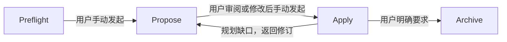

# FallaOpenSpec

FallaOpenSpec 是仅用于 Android 客户端项目的官方 OpenSpec 工作流扩展层，支持 Android View 与
Jetpack Compose。官方 `openspec` CLI 是唯一的 change、artifact、
Schema 解析、校验和归档内核；本项目只保留 Falla 特有的规则、父子任务协调、Skill/Hook 安装、
运行时检查与可选工具接入。

## 边界

- 核心命令始终使用官方 `openspec`，本项目不提供 `new change`、`status`、`instructions`、
  `validate` 或 `archive` 的替代实现。
- 不导入 `@fission-ai/openspec/dist` 等内部模块，不复制官方 artifact graph 或 Schema 解析器。
- 工作流只读写标准 `openspec/`，保持单一、干净的工作流事实源。
- 当前支持 OpenSpec `>=1.12.0 <1.13.0`，契约测试固定使用 `1.12.0`。
- 安装不提供 `--force`，遇到用户修改或受管内容漂移会停止。

## 职责与事实源

规则归属和读取入口统一见 [Soul](templates/skill-spec/[Must%20Read]soul.md)。阶段文档负责决策，
跨阶段细则由 references 定义；Skill 编排命令，Schema 定义产物契约，模板提供结构。
改规则时只修改权威文档和对应测试，其他入口保持引用。



图仅显示阶段导航，箭头不表示自动执行。阶段发起权限见 [Soul](templates/skill-spec/[Must%20Read]soul.md)，
回退顺序见[协作规则](templates/skill-spec/references/coordination.md)。

日常 single：Preflight 核对独立行为，Propose 确认规格、任务和验证安排，用户再手动发起 Apply。
每轮验证一个 task、更新当前 tasks/comate 并暂停，同一会话回复“继续”恢复下一轮。
规则按[协作规则的场景导航](templates/skill-spec/references/coordination.md#按场景读取)读取，交接按
[handoff 增量更新](templates/skill-spec/references/coordination.md#handoff-增量更新)填写；跨 change 依赖、旧记录或基线变化时追加对应章节。

## 初始化与更新

第一次安装：初始化项目的 OpenSpec，再运行 `falla-openspec install`。
以后更新：查看 `.falla/install-manifest.json`，用原来的 `--tools` 重跑 `install`。
两次都要运行 `doctor`，结束后重开 Agent 会话。命令和排障方法见[安装手册](docs/installation-and-update.md)；它也会复制到目标项目的 `.falla/installation-and-update.md`。

安装手册的首次安装示例带了 Figma、CodeGraph、Lark 和 WebP 工具；用不到就删掉对应的 `--with-*` 参数。受管文件有冲突时，安装器会停止，不会用 `--force` 覆盖你的修改。
UI 知识库的具体用法见 [`docs/ui-component-knowledge-base.md`](docs/ui-component-knowledge-base.md) 或目标项目的 `.falla/ui-knowledge/README.md`。
历史方案、审计和交接线索见[文档索引](docs/README.md)，按记录日期查阅，现行规则仍以安装版本为准。

设计授权、跨阶段复用、`design-source.md` 取证和资源取得遵循
[设计源规则](templates/skill-spec/references/design-tools.md)；UI 验证与生命周期要求见
[Android 质量规则](templates/skill-spec/references/android-quality.md)。PRD 评论取证及 `prd-source.md`
规则见 [Preflight](templates/skill-spec/[分析必读]preflight.md)。

## Android 项目校验与认领

```bash
# 全项目只读检查：安装、工作流、知识、集成分别报告
falla-openspec doctor --json
# 校验当前项目知识；不生成或修改条目
falla-openspec ui-knowledge validate --json
# 只读生成引用文件的 SHA-256，供 reviewer 核对后写入 source-hashes
falla-openspec ui-knowledge fingerprint .falla/ui-knowledge/components/retry-list.md --json
# 使用 config.yaml 中的 Provider 构建、增量同步和查询本地派生索引
falla-openspec ui-knowledge index build --json
falla-openspec ui-knowledge index sync --json
falla-openspec ui-knowledge index query --text "排行榜身份勋章" --json
falla-openspec ui-knowledge index status --json
# rebuild 原子替换现有索引；clear 只删除 .index/
falla-openspec ui-knowledge index rebuild --json
falla-openspec ui-knowledge index clear --json
# 阶段开始或源码变化后，准备已启用的图谱；失败可有界降级
falla-openspec codegraph prepare --json
# single 父 change 或 parallel 逻辑子 change 均使用排他认领
falla-openspec coordination preflight medal --json
# 基线检查只读；首次规划或显式影响复核后才记录
falla-openspec coordination baseline medal --json
falla-openspec coordination baseline medal --record --owner developer-a --json
falla-openspec coordination claim medal --owner developer-a --json
```

`doctor` 的 `groups` 包含 `installation`、`workflow`、`knowledge`、`integrations`。
任一已检查分组失败时 doctor 返回非零；安装器的 `ok` 只表示安装完整性，同时附带完整 doctor
报告。图谱不可用可以有界降级，非法知识条目被排除；它们不等于工作流文件安装失败。

知识校验只证明 Markdown 结构和引用文件指纹符合协议，`direct-reuse-candidate` 仍需由当前
CodeGraph、依赖、资源及生命周期核对决定是否复用。旧 verified 条目缺少 `source-hashes` 时
会报告待补证据，不自动降级或改写。外部 Figma/Lark 认证、CodeGraph MCP 连接与索引新鲜度不由 doctor 证明。

基线快照保存在 comate，不保存需求/设计正文。来源或任务完成条件改变会要求复核，不自动清空 checkbox；
已完成/实施中旧记录缺快照报告未核验，不能通过直接 --record 追认。按 coordination 的 baseline-review
影响清单先回退受影响任务、父子状态和人工验收，再由原 owner 记录；不受影响进度保留。只读检查和验证
不改记录，已归档内容不原地重新批准。机器不判断自然语言影响范围，也不证明人工反馈或验证证据真实。

## 标准工作流

父 change 及其 artifacts 由官方 CLI 管理：

```bash
openspec new change "medal" --schema falla-spec-driven --json
openspec status --change "medal" --json
openspec instructions proposal --change "medal" --json
```

`falla-propose` 默认使用 `single` 模式：ViewModel、View、控件和联调只拆成父 change
`tasks.md` 内的任务组，不自动创建额外目录。只有用户明确要求多人/多 Agent 并行、创建子 change
或独立分派时，才使用 `parallel` 模式。

OpenSpec 的物理 change 名不支持 `/`。parallel 模式创建子 change 时先注册逻辑引用，再把返回的
`physical` 交给官方 CLI：

```bash
falla-openspec coordination register "medal/achievement-detail" --json
openspec new change "medal-child-achievement-detail" --schema falla-task-driven --json
falla-openspec coordination resolve "medal/achievement-detail" --json
falla-openspec coordination validate --change "medal" --json
# 父子规划完成、用户明确进入协调回合后，先认领父协调职责
falla-openspec coordination claim "medal" --coordinator --owner coordinator-a --json
# 子代码实施独立认领；父协调身份不自动授予子代码权限
falla-openspec coordination claim "medal/achievement-detail" --owner developer-a --json
```

如果官方 `new change` 失败且没有创建物理目录，可安全清理本次孤儿映射：

```bash
falla-openspec coordination unregister "medal/achievement-detail" --json
```

物理 change 已存在时 unregister 会拒绝，不会删除任何 change 文件。

parallel 父协调者负责父里程碑、汇总验收、暂停/恢复和最终归档，不代改子记录。
新父保留 `unassigned/todo`；子认领须父协调者已就位。状态流转和经用户确认的交接使用：

```bash
# 先在父 handoff 写暂停证据、受影响范围与恢复条件
falla-openspec coordination transition "medal" --owner coordinator-a --status blocked --json
# 各 owner 回退/复核自己的记录后，父才可恢复；不会自动勾任务或通过人工验收
falla-openspec coordination transition "medal" --owner coordinator-a --status in-progress --json
falla-openspec coordination transition "medal" --owner coordinator-a --status done --json
# 原 owner 先在 handoff 写交接确认依据与接手操作，候选者不能抢占
falla-openspec coordination transfer "medal" --owner coordinator-a --to coordinator-b --json
```

暂停可以在证据失效时先行阻断，恢复/完成仍检查全部门禁。命令只写父字段，不自动撤销子进度；
旧合法父身份无需重写；旧未分配父却有子进度时，先由子 owner 暂停，初始化待认领父基线，
按依赖复核子基线，最后认领父；详见协作规则，不手填身份或刷新 hash 追认。owner 是协作标识而非认证，
锁只覆盖同一真实项目内 CLI 写入；直接文件编辑及跨机器协作仍须约定责任与停止旧会话。

映射只保存在 `.falla/coordination.yaml`。负责人、状态、正向依赖和交接以各 change 的
`comate.md` 为唯一事实来源；反向 blocks 由正向依赖推导。`coordination validate` 检查缺失节点、环、
前置状态、tasks 完成度、本地任务编号与依赖图、结构化 handoff 和 OpenSpec artifact 状态。
任务格式与已有 change 的兼容规则见 Propose“任务拆解”；doctor 与 claim 使用同一任务校验结果。

Propose 前执行 `coordination preflight <change> --json`，Apply 认领时在锁内重新检查父 `preflight.md`
的准入台账；未决 Blocker、未核验旧记录及缺少决定依据均不放行。字段与迁移规则见
[Preflight](templates/skill-spec/[分析必读]preflight.md)“阻塞项准入记录”。此检查不替代官方 artifact 状态，
也不能证明填写的确认依据真实有效；原有确认需由 Agent 核实，不能自动填成“已确认”。

### 人工验收只记录结果

每项人工任务只在本 change 的 comate 中记录任务编号和结果：

```text
- 人工任务结果 (human-task-results): [["1.1","passed"],["1.3","pending"]]
```

`pending` / `passed` / `failed` 分别为待验收、通过、不通过。只有本项通过后才勾选人工任务，
程序检查结果与勾选一致，不验证验收真实性，不要求截图、过程材料、反馈正文或逐项指纹。
允许部分通过、其余待验收；总 human-review 为 pending 不阻断已通过项。结果撤销或基线变化时按
协作规则回退受影响项及其后继，保留其他有效结果。旧笼统反馈不自动转换为逐项通过。

## OpenSpec 1.12 兼容

- doctor 使用 `openspec status --all --json` 批量读取状态，避免逐 change 启动进程。
- 以 `isPlanningComplete` 为规划完成态；`skip_specs: true` 产生的 `skipped` artifact 视为已满足，
  不要求创建空 delta spec。
- change 名遵循新版 kebab-id，可由数字开头；tasks 中的嵌套 checkbox 与 `*` checkbox 同样计入门禁。
- apply/archive Skill 会分别读取 `context` 与 `operationGuidance`，后者只作为操作建议，不能覆盖
  官方状态、路径、安全门禁或用户明确选择。
- `.openspec.yaml` 支持官方 `skip_specs` 和 `retire_capabilities`；能力退役会删除主规格，仍需用户
  针对本次归档明确确认。

## OpenSpec 升级流程

不要直接升级生产项目中的 OpenSpec。每次升级按以下顺序处理：

1. 在本项目中把 `devDependencies` 的 OpenSpec 固定版本改为待验证版本，暂不扩大
   `peerDependencies` 支持范围。
2. 阅读官方变更说明，重点核对 CLI 参数和 `list/status/instructions/validate/schema` 的 JSON 契约。
3. 运行 `npm run check` 和 `npm test`；契约、两套 Schema、安装与完整工作流必须全部通过。
4. 在临时项目执行 install、doctor、父子协调和归档契约测试，确认受管内容幂等且无漂移。
5. 仅在兼容性已验证后扩大 `SUPPORTED_OPENSPEC_RANGE` 和 `peerDependencies`，再发布对应的
   FallaOpenSpec 版本。若官方存在破坏性变化，保持旧支持分支并单独实现适配层。

因为扩展只调用官方可执行文件和公开 JSON 输出，升级通常只需要调整窄契约、Schema 模板或命令
参数，不需要重新合并一份魔改 OpenSpec 源码。

## 验证与风险

```bash
npm run check
npm test
```

主要风险：官方小版本改变 JSON 字段或 Schema 语义；人工修改受管文件；Hook 所需规则文件缺失。
版本门禁、公开契约测试、项目锁、受管哈希和原子写入用于把这些情况转成显式失败。写入前会
复核计划时的文件哈希，但多文件更新不是事务，外部编辑器在最终核对与替换之间仍存在极短竞争窗口。
认领锁只覆盖同一台机器上的同一真实项目目录，不替代跨机器协调、工作树隔离或代码合并。报告不输出
环境变量、凭据或规格正文。
