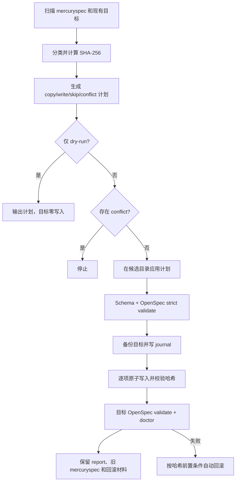

# FallaOpenSpec 工作流审查与完整流程分析

> 审查日期：2026-09-09
>
> 审查对象：OpenSpec 1.12 兼容基线
>
> 审查方式：源码与模板审查、官方 OpenSpec 1.12 契约核对、自动化测试、真实 Android 项目只读迁移预演

## 1. 结论

这次迁移的总体方向是正确的：项目已经把 change、artifact、Schema、校验和归档职责交还给官方 OpenSpec，FallaOpenSpec 只保留工作流规则、Agent Skill/Hook、父子 change 协调和 MercurySpec 迁移层。相比继续维护魔改内核，这个边界更清楚，后续升级成本也更可控。

当前版本已正确锁定并验证 OpenSpec `1.12.0`，且截至审查日，官方 GitHub Releases、npm 版本页和官方仓库 `package.json` 均显示 `1.12.0` 为最新版本。

不过，目前还不建议把它认定为“可以直接对生产项目执行完整迁移并闭环归档”。审查发现 3 个应在正式迁移前处理的高优先级问题：

1. 已归档子 change 会让 CLI 的 `coordination validate` 失败，导致父子工作流无法正常逐步归档。
2. 真实 MercurySpec 项目中存在“扁平归档子 change”，当前扫描器会把它们误判成父 change，丢失逻辑父子映射。
3. 迁移事务在最终 OpenSpec 校验之前就把 journal 标记为 `applied`，进程被强制终止时存在“未验证结果被当作成功”的恢复窗口。

此外，真实 Android canary 的 dry-run 当前还有 1 个业务规格冲突，因此即使修复代码问题，也必须先人工合并该冲突再执行 `--apply`。

综合判断：

| 维度 | 结论 |
| --- | --- |
| 官方 OpenSpec 替代魔改内核 | 通过，架构边界合理 |
| OpenSpec 1.12 版本适配 | 基本通过，窄契约仍需补强 |
| 新 change 主流程 | 基本可用 |
| 父子 change 协调 | active 阶段可用，归档生命周期有阻断缺陷 |
| MercurySpec 迁移 | 安全机制较完整，但真实历史结构识别不完整 |
| 回滚 | 普通异常可回滚，强制退出恢复存在窗口 |
| 安全与泄露控制 | 总体良好，诊断输出的绝对路径策略需统一 |
| 当前生产迁移就绪度 | 暂不通过 |

## 2. 审查范围与证据

本次审查覆盖：

- `src/` 下的 CLI、安装、doctor、协调、OpenSpec 适配、迁移、事务和交互进程逻辑；
- 四套 Falla Schema 及其 artifact graph；
- preflight、propose、apply、archive 四个 Agent Skill；
- Claude/Codex Hook 安装和生命周期；
- 从旧 MercurySpec 到官方 OpenSpec 的扫描、转换、预演、应用、校验和回滚；
- 同级旧项目 `falla-mercury` 的结构，以及真实 Android canary 项目的旧数据形态；
- 官方 OpenSpec 1.12 CLI 的公开 JSON 和命令参数；
- Codex 项目配置与 `SessionStart` Hook 的官方语法。

需要注意：当前工作区本身已有多项用户未提交改动。本次审查以这些改动后的实际快照为准，没有覆盖或回退它们。

## 3. 架构边界

### 3.1 责任分配

| 事实或能力 | 唯一事实来源 / 执行者 | FallaOpenSpec 的职责 |
| --- | --- | --- |
| 项目主规格 | `openspec/specs/` | 不复制、不替代解析 |
| change 与 artifact 状态 | 官方 `openspec` CLI | 消费公开 JSON，做窄契约检查 |
| Schema 解析与 artifact graph | 官方 OpenSpec | 安装四套自定义 Schema 模板 |
| validate 与 archive | 官方 OpenSpec | 增加协作门禁和用户确认规则 |
| 任务完成度 | `tasks.md` + 官方 apply 状态 | 额外解析 checkbox，和 comate 联合校验 |
| owner、依赖、阻塞和交接 | 各 change 的 `comate.md` | 校验字段、双向边、环与状态 |
| 逻辑父子名到物理名 | `.falla/coordination.yaml` | 注册、解析和持久化映射 |
| Agent 行为约束 | `.falla/skill-spec/`、安装后的 Skills/Hooks | 安装、注入和漂移检查 |
| 旧项目数据 | `mercuryspec/` | 只读扫描和迁移，不作为新流程事实源 |

### 3.2 边界审查结果

通过项：

- 没有导入 `@fission-ai/openspec/dist`、`src` 等内部模块。
- Falla CLI 没有重新实现 `new change`、`status`、`instructions`、`validate` 或 `archive`。
- 外部命令通过参数数组启动，并关闭 shell 拼接，降低命令注入风险。
- 官方命令失败时只返回脱敏摘要，默认不回显原始 stdout、stderr、参数或环境变量。
- `mercuryspec/` 在迁移中保持只读，成功后也不会自动删除。

这个架构应该继续保持。后续修复不应重新引入一套本地 OpenSpec 状态机，也不应读取官方包的内部实现来绕过公开契约。

## 4. 完整工作流

### 4.1 总流程


### 4.2 初始化与安装

预期顺序：

```bash
npm install -g @fission-ai/openspec@1.12.0
openspec init --tools none /path/to/project
falla-openspec install /path/to/project --tools claude,codex --non-interactive
falla-openspec doctor /path/to/project --json
```

安装阶段的实际行为：

1. 查找目标项目并检查官方 OpenSpec 版本，当前允许 `>=1.12.0 <1.13.0`。
2. 获取项目级 install 锁，防止同一项目并发安装或与迁移交叉写入。
3. 收集四套 Schema、Falla 规则、所选工具 Skills 和 Hook。
4. 比对 `.falla/install-manifest.json` 中的旧哈希：
   - 文件不存在时新建；
   - 当前内容等于目标内容时跳过；
   - 当前内容仍等于上次受管哈希时允许升级；
   - 用户已修改受管文件或 marker 时停止，不覆盖。
5. 单文件采用临时文件加 rename 的原子写入。
6. 写入安装 manifest，再运行 doctor。
7. Figma、Lark 只在显式选择时安装；失败只生成 warning，不影响核心安装结果。

Codex Hook 的 TOML 结构符合官方 `[[hooks.SessionStart]]` / `[[hooks.SessionStart.hooks]]` 语法，Hook 返回的 `hookSpecificOutput.additionalContext` 也符合官方格式。运维文档仍应补充两点：项目必须被 Codex 信任；安装或移动项目后需要重新打开会话，移动目录还应重装以更新 Hook 中的绝对路径。

### 4.3 Preflight

父 change 使用 `falla-spec-driven` Schema 创建：

```bash
openspec new change "<parent>" --schema falla-spec-driven --goal "<goal>" --json
openspec instructions preflight --change "<parent>" --json
openspec status --change "<parent>" --json
```

规则边界合理：

- 必须完整读取 PRD；
- 只检查直接相关实现和文档；
- 用代码、接口、模型或测试证据描述现状；
- 输出只限 `preflight.md`；
- 不创建后续 artifacts，不修改业务代码。

这能避免分析、方案和编码混在同一阶段。若 PRD 不可访问或范围无法确定，工作流应停在 preflight，而不是猜测后继续。

### 4.4 Propose 与子 change 拆分

父 change 的 artifact graph 是：

```text
preflight -> proposal -> specs ----\
                      -> design ----> tasks -> comate -> apply
```

当 `.openspec.yaml` 显式设置 `skip_specs: true` 时，官方 OpenSpec 1.12 会把 `specs` 标记为 `skipped`，用于纯重构、工具或文档变更。此时不应创建空 requirement。

子 change 使用 `falla-task-driven`：

```text
tasks -> comate -> apply
```

父子协调采用两层逻辑名：

```text
medal/achievement-detail
        |
        +-- coordination register
        |
        v
medal-child-achievement-detail
```

完整创建顺序应为：

```bash
falla-openspec coordination register "<parent>/<child>" --json
openspec new change "<returned-physical>" --schema falla-task-driven --json
openspec instructions tasks --change "<returned-physical>" --json
openspec instructions comate --change "<returned-physical>" --json
falla-openspec coordination validate --change "<parent>" --json
```

`comate.md` 保存 `owner`、`status`、`depends-on`、`blocks`、`handoff`；协调文件只保存逻辑名、物理名和父 change，不复制协作状态。这一设计避免双写，是正确的。

### 4.5 Apply

逻辑子 change 的实施顺序：

1. `coordination resolve` 得到物理名和生命周期。
2. `coordination validate --change <parent>` 校验完整 DAG。
3. owner 未分配时先认领，将 comate 更新为 `in-progress`。
4. 使用物理名读取官方 `status` 和 `instructions apply`。
5. 读取官方 `contextFiles`、`context`；子 change 再通过映射读取父 change 的规划 artifacts。
6. 仅实施当前 change 的最小范围；验证完成后才勾选 task。
7. 不明确、设计冲突或运行错误时更新为 `blocked`，写明原因、当前进度和下一步。
8. 全部任务和验证完成后才把 comate 标记为 `done`，再次运行协调校验。

协调校验目前会检查：

- 映射和物理 change 是否存在；
- `comate.md`、`tasks.md` 是否存在且格式可解析；
- owner、blocked handoff 和 done/task 一致性；
- depends-on / blocks 是否双向；
- 依赖节点是否存在；
- 是否有环；
- 下游进入 `in-progress` 或 `done` 时，上游是否已 done；
- comate done 时，官方规划 artifacts 是否完成。

Skill 中已经明确要求检查空值/NPE、异步和观察者生命周期、销毁后 UI 更新与敏感日志。这部分与 Android 实施风险匹配，建议保留为强约束。

### 4.6 Archive

设计中的归档顺序是先子后父：

```bash
openspec validate "<physical>" --strict --json --no-interactive
openspec status --change "<physical>" --json
openspec instructions archive --change "<physical>" --json
falla-openspec coordination validate --change "<parent>" --json
openspec archive "<physical>" --json --yes
```

如果存在告警，Skill 要求把选择交给用户：先修复、明确接受告警、或明确跳过 spec 同步。只有本次操作得到明确确认后才能添加 `--no-validate` 或 `--skip-specs`。能力退役还需要用户明确设置 `retire_capabilities: true`，因为它可能删除主规格。

该设计的人机边界是合理的，但当前实现存在严重生命周期缺陷：第一个子 change 归档后，下一次 `coordination validate` 仍会对这个已归档物理名调用 `openspec status --change`。官方 status 只查 active change，因此整个父 DAG 会出现 `invalid-node`，阻断后续子 change 和父 change 的标准归档流程。详见 F-01。

### 4.7 MercurySpec 迁移

迁移流程分为只读预演和显式应用：



扫描阶段具备以下保护：

- 拒绝项目外符号链接和符号链接目录；
- 拒绝 `.env`、token、secret、private key、keystore 等敏感文件名；
- 拒绝未知二进制附件，只允许有限图片/PDF 类型；
- 为源文件记录 SHA-256，计划后再次读取时校验未被修改；
- 结构化文件限制为 4 MiB，并限制 YAML alias；
- 目标冲突会汇总，而不是在第一个冲突处停止；
- 新旧 config 和 coordination 使用带目标哈希前置条件的结构化合并。

应用阶段具备候选验证、目标备份、逐文件原子写入、写后哈希、最终验证、doctor、自动回滚和显式回滚。显式回滚发现迁移后文件被人工修改时会拒绝覆盖。整体安全设计是本项目最扎实的部分。

迁移不会删除旧 `mercuryspec/`。建议把旧目录删除定义为迁移验收后的独立人工步骤，并在备份保留期结束后执行，不要加入自动迁移事务。

### 4.8 OpenSpec 升级

当前做法是：

- `devDependencies` 固定 `@fission-ai/openspec: 1.12.0`；
- `peerDependencies` 和运行时门禁限制为 `>=1.12.0 <1.13.0`；
- 契约测试调用真实官方 CLI；
- 四套 Schema、完整工作流和迁移回滚均纳入测试；
- 真实项目只执行 dry-run canary。

升级顺序应保持为：先固定待验证版本，核对官方变更，再更新窄契约和 Schema，完成自动测试与真实只读 canary，最后才扩大支持范围。不要因为 semver 是小版本就自动放宽 peer range。

## 5. 问题清单

### F-01：已归档子 change 会破坏 CLI 协调校验

- 优先级：P0
- 位置：`src/coordination/dag.js:51-74`、`src/commands/coordination.js:86-95`
- 证据：`resolveChange` 能定位 archive，但 `readNode` 无条件调用 `statusProvider(mapping.physical)`；CLI provider 执行 `openspec status --change <physical> --json`。
- 复现结果：一个映射子 change 归档后，再校验父 change，返回 `invalid-node` 和脱敏后的“OpenSpec 命令执行失败”。
- 影响：标准“逐个归档子 change，最后归档父 change”无法闭环；归档一个子节点后，剩余节点的门禁也无法继续运行。
- 测试缺口：resolver 测了 archive 定位，CLI 测了 active 协调，但没有覆盖“同一父 DAG 中 active 与 archived 子节点并存”。
- 建议：只有 `resolved.lifecycle === 'active'` 时读取官方 status；archive 节点以归档内 `tasks.md`、`comate.md` 和生命周期作为校验依据。增加 active/archived 混合 DAG 的端到端测试。

### F-02：扁平归档子 change 被误判为父 change

- 优先级：P0
- 位置：`src/migration/scanner.js:37-57`、`src/migration/planner.js:69-130`
- 证据：扫描器只凭路径判断子 change，只有 `archive/<date-parent>/changes/<child>/...` 才归类为 `archived-child-change`。
- 真实数据：canary 中至少有 6 个 `archive/<date-child>/.openspec.yaml` 带有合法 `parent` 字段，但均被归类为 `archived-parent-change`：
  - `achievement-center-entry` → `medal`
  - `profile-medal-wall` → `medal`
  - `cross-scene-acceptance` → `medal`
  - `data-model-identity-label` → `external-role-identity-tag`
  - `mystery-medal-decouple` → `external-role-identity-tag`
  - `profile-home-identity-label` → `external-role-identity-tag`
- 影响：这些历史子 change 保留原归档目录名，却不会写入 `.falla/coordination.yaml`，逻辑父子关系和后续审计能力丢失。
- 测试缺口：测试 fixture 只有嵌套归档形态，没有覆盖生产数据中的扁平归档形态。
- 建议：先按 change 根目录聚合文件并尽早解析 `.openspec.yaml`；存在经过格式校验的 `parent` 时按扁平子 change 分类。一个 change 根下所有文件必须共享同一分类和目标目录，并补充 active/archive 重复逻辑名检查。

### F-03：迁移 journal 过早进入 applied

- 优先级：P1，正式迁移前应处理
- 位置：`src/migration/transaction.js:200-217`、`304-318`、`429-450`
- 证据：全部目标文件写完后立即设置 `journal.phase = 'applied'`，之后才执行目标 OpenSpec 校验和 doctor；中断恢复逻辑看到 `applied` 会直接跳过。
- 已验证现象：在 `validateTarget` 回调中读取 journal，phase 已是 `applied`。
- 影响：普通异常会进入 catch 并自动回滚，但如果进程在最终校验或 doctor 期间被 kill、断电或崩溃，下次启动会把未完成最终验证的目标当成已成功应用。
- 测试缺口：现有测试覆盖“最终校验抛错后回滚”，没有覆盖最终校验阶段的硬中断与下次恢复。
- 建议：写完目标后进入 `written` 或 `validating`；只有目标校验、doctor 和 report 成功后才进入 `applied`/`committed`。恢复逻辑应回滚 `prepared`、`writing`、`written`、`validating`。

### F-04：register 没有检查真实 change 名冲突

- 优先级：P1
- 位置：`src/coordination/resolver.js:59-77`
- 证据：`occupied` 只包含 coordination 中已有 physical 名，没有扫描 `openspec/changes/` 和 archive。
- 复现结果：目标中已有未受管的 `medal-child-detail` 时，register 仍把它分配给 `medal/detail`；随后官方 `openspec new change` 失败，mapping 已经落盘。
- 影响：可能把新的逻辑引用错误指向历史或手工创建的物理 change，并留下没有对应新 change 的孤儿映射。
- 建议：注册前收集 active 和 archive 的全部物理 change ID；冲突时再追加固定哈希。还应提供可恢复操作，例如 `coordination unregister`，或让创建流程在官方 new 失败时安全撤销本次 reservation。

### F-05：重复安装不会清理已取消选择或版本已删除的受管文件

- 优先级：P1
- 位置：`src/commands/install.js:110-134`
- 证据：新 manifest 从 `{ ...previousFiles }` 开始，只覆盖当前计划，不删除不再规划的路径。
- 场景：第一次安装 `claude,codex`，第二次只选择 `codex`，Claude Skill/Hook 及 manifest 条目仍保留；未来版本删除某个模板也会留下旧文件。
- 影响：目标项目可能继续执行已禁用或已淘汰的规则，安装版本与实际运行规则生命周期不一致；doctor 仍可能报告健康。
- 建议：manifest 增加明确的工具集合；对“旧 manifest 有、当前计划没有”的文件生成 prune 计划。仅当当前哈希仍等于旧受管哈希时删除，用户修改过的文件必须保留并报告冲突。

### F-06：公开 JSON 契约没有覆盖全部实际消费字段

- 优先级：P1
- 位置：`src/openspec/contract.js:52-116`、`.falla` archive/apply 规则模板
- 证据：archive 规则读取 status 的 `artifactPaths.specs.existingOutputPaths`，但 `assertStatusContract` 未校验 `artifactPaths`；apply 只检查 `contextFiles` 是对象，没有校验其中的路径数组；artifact instructions 的 `existingOutputPaths` 和 `dependencies` 也只检查 array，未检查成员类型，tasks 元素结构未锁定。
- 影响：OpenSpec 后续小版本改变嵌套字段时，contract test 可能继续通过，直到 Agent 执行到 apply/archive 才失败或读取错误路径。
- 建议：只为真实消费的嵌套字段增加窄校验，不要锁定无关字段。真实 CLI fixture 应覆盖 glob spec、`skip_specs`、无可选 context/guidance 和 archive instructions。

### F-07：真实 Android 项目当前存在目标冲突

- 优先级：迁移数据阻断，不是实现缺陷
- 证据：真实 canary dry-run 统计为 `copy=85`、`write=28`、`skip=29`、`conflict=1`。
- 冲突：`mercuryspec/specs/gift-panel/spec.md` 与 `openspec/specs/gift-panel/spec.md` 内容不同，原因 `target-different`。
- 影响：当前执行 `migrate --apply` 会按设计拒绝开始。
- 建议：人工比较业务语义并合并，禁止用强制覆盖消除冲突。处理后重跑 dry-run，要求 `conflict=0`，同时确认 F-02 已修复并产生完整映射。

### F-08：诊断输出与 README 的隐私承诺不完全一致

- 优先级：P2
- 位置：`src/commands/doctor.js:175-200`、coordination resolve 输出、README“验证与风险”
- 证据：README 表述报告只包含状态、计数、哈希和相对路径，但 doctor 返回项目根绝对路径，resolve 也返回物理目录绝对路径。
- 影响：CI 日志或共享报告可能泄露本机用户名和目录结构。它通常不是凭据泄露，但与文档承诺不一致。
- 建议：二选一：文档明确绝对路径是本地诊断字段；或默认 JSON 使用相对路径/脱敏 root，仅在 `--debug` 或显式 verbose 时输出绝对路径。

### F-09：安装仅保证单文件原子，不保证整次安装事务性

- 优先级：P2
- 位置：`src/commands/install.js:110-136`
- 证据：managed files、Hook、manifest 顺序写入，最后运行 doctor；中途失败不会恢复之前已写文件。
- 影响：磁盘异常、权限变化或进程中断会留下部分安装。多数情况可通过重跑收敛，但并非严格事务。
- 建议：至少在文档中说明“可重入但非整批原子”；若后续要支持自动部署，可复用迁移事务模式，先生成完整计划和备份，再提交 manifest。

### F-10：legacy 父 Schema 与统一 archive Skill 的 comate 策略不一致

- 优先级：P2
- 位置：`templates/openspec/schemas/falla-legacy-spec-driven/schema.yaml`、archive Skill
- 证据：legacy 父 Schema 为避免强制补 artifact，没有 `comate`；archive Skill 却统一要求汇总非 done comate 和父子交接。
- 影响：继续处理迁移后的旧父 change 时，doctor 可能认为 Schema/状态有效，但归档流程仍要求人工接受缺失协作记录，行为容易被误解。
- 建议：明确 legacy 归档策略：要么允许“无 comate 的历史父 change”作为显式 legacy 例外，要么在迁移时生成只含可验证历史信息的 comate，不能虚构 owner 或完成状态。

### F-11：旧交接文档已不再可信

- 优先级：P2，文档治理
- 证据：`HANDOFF-REMAINING.md` 的部分章节仍描述 OpenSpec 1.5 和旧测试数量，同时其他章节又称 1.12 升级已完成。
- 影响：后续维护者可能根据过期清单重复工作或错误判断支持范围。
- 建议：更新或删除该文档；版本、测试数和支持范围以 `package.json`、运行时门禁、当前测试和本审查文档为准。

## 6. 安全、泄露与生命周期审查

### 6.1 已确认的安全措施

- 安装和迁移路径均做相对路径约束与祖先目录检查。
- 模板和目标中的危险符号链接会被拒绝。
- 外部进程使用参数数组，不使用 shell 拼接；超时会先 SIGTERM，再升级 SIGKILL，并清理 timer。
- 迁移扫描会拒绝常见凭据、私钥、keystore 和异常二进制文件。
- 报告不包含规格正文、owner、handoff、外部命令 stdout/stderr 或环境变量。
- 文件写入使用权限 `0600` 的临时文件后 rename。
- 迁移源和目标都用 SHA-256 前置条件避免 TOCTOU 覆盖。
- install 与 migrate 使用同一项目的交叉锁，避免并发写入生命周期错位。
- Figma 和 Lark 为显式可选能力，不接收或打印凭据；失败不会污染核心安装事务结果。

### 6.2 仍需处理的生命周期风险

- 归档后状态查询仍按 active 生命周期执行，见 F-01。
- 迁移 journal 的提交状态早于最终校验，见 F-03。
- 安装选择变化不会淘汰旧受管文件，见 F-05。
- Codex Hook 内嵌项目绝对路径，项目移动后必须重装，否则 SessionStart 会引用旧位置。
- 交互 UI 的正常完成路径会恢复 raw mode、监听器和定时器；若未来修改渲染初始化流程，应继续确保“开启 raw mode 后的所有异常路径”都进入 finally 清理。

### 6.3 泄露结论

没有发现凭据正文、环境变量、PRD/规格正文或外部进程原始错误被默认写入报告的路径。主要残余是本地绝对路径可能进入 doctor/resolve JSON，属于环境元数据暴露，应按 F-08 统一策略。

## 7. 自动化验证结果

| 检查 | 结果 |
| --- | --- |
| `npm run check` | 通过 |
| `FALLA_ANDROID_CANARY_ROOT=... npm test` | 102/102 通过，0 skipped，本次复验约 21.7 秒 |
| 官方 OpenSpec 公开契约测试 | 通过，实际 CLI 为 1.12.0 |
| 四套 Schema 官方校验 | 通过 |
| 完整 install/migrate/validate/resolve/rollback E2E | 通过 |
| 真实 Android canary 零写入检查 | 通过 |
| `npm audit --audit-level=high` | 0 vulnerabilities |
| `npm pack --dry-run --json` | 66 个预期文件；未包含 test、node_modules、`.DS_Store` |

测试全绿与问题清单并不矛盾：

- F-01 的 archive resolver 和 active CLI 各自有测试，但缺少组合生命周期测试。
- F-02 的 fixture 只包含嵌套归档子 change，没有复制真实扁平历史结构。
- F-03 测了 JavaScript 异常回滚，没有模拟最终校验期间的进程硬中断。
- F-04 测了 coordination 映射之间的名称冲突，没有测试未受管物理目录冲突。
- F-05 测了初装、幂等和用户漂移，没有测试工具取消选择或新版模板删除。
- F-06 的真实 CLI 测试没有断言全部实际消费的嵌套字段。

## 8. 真实 Android canary 分析

只读 dry-run 没有修改 `mercuryspec/`、`openspec/` 或 `.falla/`，这项安全门禁有效。当前计划结果：

```text
copy:      85
write:     28
skip:      29
conflict:   1
mappings:  15
```

迁移不应立即执行，原因有两个：

1. `gift-panel/spec.md` 存在真实目标冲突，需要人工合并。
2. 15 个 mapping 不包含 F-02 所列 6 个扁平归档子 change；如果现在应用，文件虽然大多仍会被复制，但父子语义不会完整迁移。

正式 canary 的通过条件建议定义为：

- `conflict=0`；
- 扁平和嵌套子 change 均产生逻辑映射；
- 所有计划目标只有相对路径；
- dry-run 前后三个目录哈希不变；
- candidate 和 target 均通过 OpenSpec strict validate 与 doctor；
- 迁移后抽样执行 active/archived 混合协调校验；
- 记录 migration id，并在副本上实际演练一次 rollback。

## 9. 建议修复顺序与发布门禁

### 第一批：正式迁移前必须完成

1. 修复 F-02，补真实扁平归档 fixture 和 mapping 断言。
2. 修复 F-01，补“先归档一个子 change，再继续校验和归档”的 E2E。
3. 修复 F-03，引入 `written/validating/committed` 生命周期并测试硬中断恢复。
4. 修复 F-04，避免映射与真实物理 change 冲突，并提供孤儿 mapping 的修复路径。
5. 人工解决 canary 的 `gift-panel` 业务规格冲突。

### 第二批：发布前建议完成

1. 补强实际消费的 OpenSpec JSON 契约，处理 F-06。
2. 实现安全 prune 或明确工具不可撤销，处理 F-05。
3. 明确 legacy 无 comate 的归档政策，处理 F-10。
4. 统一 JSON 报告中的绝对/相对路径策略，处理 F-08。

### 第三批：维护性改进

1. 为 install 增加整批事务或明确可重入恢复流程。
2. 更新或删除过期 `HANDOFF-REMAINING.md`。
3. 在 README 增加 Codex trust、重开会话和项目移动后重装 Hook 的说明。

建议的发布门禁：

```bash
npm run check
npm test
npm audit --audit-level=high
npm pack --dry-run --json
falla-openspec migrate /path/to/canary --json
```

其中最后一项必须保持 dry-run，直到 P0/P1 修复、`conflict=0` 且迁移计划经人工审阅。之后应先在项目副本执行 `--apply`、官方 validate、doctor 和 rollback 演练，再考虑真实项目。

## 10. 最终判断

FallaOpenSpec 已经成功完成了最关键的架构转向：官方 OpenSpec 是唯一内核，Falla 只负责扩展流程。版本门禁、公开契约、迁移只读预演、哈希前置条件、候选校验和回滚设计都表明整体方向可靠。

当前问题主要集中在“跨生命周期组合场景”，而不是基础命令本身：active 到 archived、旧嵌套结构到官方扁平结构、文件写完到最终验证、工具启用到取消启用。这也解释了为什么 102 个测试全部通过，真实流程仍然存在闭环缺口。

因此，本次 review 的建议不是回退架构，而是补齐生命周期模型和真实历史 fixture。完成第一批修复后，这套方案才适合从“功能验证版本”升级为“生产迁移版本”。

## 11. 官方参考资料

- [OpenSpec GitHub Releases](https://github.com/Fission-AI/OpenSpec/releases)
- [OpenSpec npm versions](https://www.npmjs.com/package/%40fission-ai/openspec?activeTab=versions)
- [OpenSpec 官方 package.json](https://github.com/Fission-AI/OpenSpec/blob/main/package.json)
- [Codex config reference](https://learn.chatgpt.com/docs/config-file/config-reference)
- [Codex Hooks](https://learn.chatgpt.com/docs/hooks)
